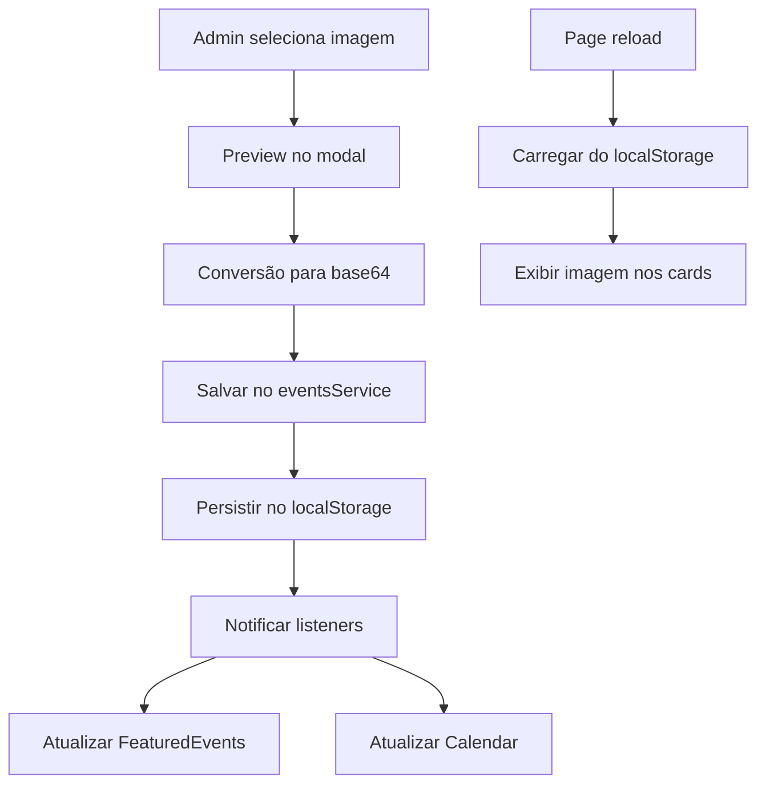

# 🖼️ Correção de Imagens nos Eventos - Instruções de Teste

## ✅ Problema Resolvido

**Problema**: As imagens inseridas nos eventos do admin não apareciam nos cards do frontend.

**Solução**: Implementado suporte completo a imagens com processamento base64 e persistência no localStorage.

## 🧪 Como Testar

### 1. Teste de Criação de Evento com Imagem

```bash
# 1. Acessar: http://localhost:3000/admin/login
# 2. Fazer login (automático)
# 3. Clicar em "Nova Corrida"
# 4. Preencher todos os campos INCLUINDO a imagem
# 5. Selecionar uma imagem do computador
# 6. Verificar se o preview aparece
# 7. Salvar o evento
```

### 2. Verificar Imagem no Frontend

```bash
# Após criar evento com imagem:
# 1. Ir para Home (/) 
# 2. Verificar seção "Eventos em Destaque"
# 3. A imagem deve aparecer no card do evento
# 4. Ir para Calendar (/calendar)
# 5. A imagem deve aparecer no card do evento
```

### 3. Teste de Edição de Evento

```bash
# 1. No Admin Dashboard
# 2. Clicar no botão "Editar" de um evento
# 3. Verificar se a imagem atual aparece no preview
# 4. Alterar a imagem (opcional)
# 5. Salvar mudanças
# 6. Verificar se a nova imagem aparece no frontend
```

### 4. Teste de Persistência

```bash
# 1. Criar evento com imagem
# 2. Fechar navegador
# 3. Abrir novamente
# 4. Verificar se a imagem ainda aparece
```

## 🔧 O que foi Implementado

### 1. Interface Event Atualizada
```typescript
export interface Event {
  id: string;
  title: string;
  description: string;
  city: string;
  date: string;
  time: string;
  eventType: string;
  sponsored: boolean;
  createdBy: string;
  imageUrl?: string; // ✅ NOVO: Campo para imagem
  createdAt?: string;
  updatedAt?: string;
}
```

### 2. Processamento de Imagem (Base64)
```typescript
// No AdminDashboard
const handleCreateEvent = async (eventData: any) => {
  // Processa imagem para base64
  let imageUrl = '';
  if (eventData.image && eventData.image instanceof File) {
    imageUrl = await new Promise<string>((resolve) => {
      const reader = new FileReader();
      reader.onload = (e) => resolve(e.target?.result as string);
      reader.readAsDataURL(eventData.image);
    });
  }
  
  // Salva evento com imageUrl
  const newEvent = await eventsService.createEvent({
    ...eventData,
    imageUrl: imageUrl
  });
}
```

### 3. Exibição no Frontend
```typescript
// FeaturedEvents
const convertAdminEvent = (adminEvent: AdminEvent): Event => ({
  id: adminEvent.id,
  title: adminEvent.title,
  date: adminEvent.date,
  location: adminEvent.city,
  distance: adminEvent.eventType,
  imageUrl: adminEvent.imageUrl // ✅ Usa a imagem salva
});

// Calendar
const convertAdminEvent = (adminEvent: AdminEvent): Event => ({
  id: adminEvent.id,
  title: adminEvent.title,
  date: new Date(adminEvent.date).toLocaleDateString('pt-BR'),
  image: adminEvent.imageUrl || `placeholder`, // ✅ Usa imagem ou placeholder
  time: adminEvent.time || undefined,
  city: adminEvent.city,
  eventType: adminEvent.eventType
});
```

### 4. Suporte a Edição de Imagem
```typescript
// EditEventModal
const handleSubmit = async (e: React.FormEvent) => {
  // Mantém imagem atual ou processa nova
  let imageUrl = event.imageUrl;
  if (formData.image instanceof File) {
    imageUrl = await new Promise<string>((resolve) => {
      const reader = new FileReader();
      reader.onload = (e) => resolve(e.target?.result as string);
      reader.readAsDataURL(formData.image!);
    });
  }
  
  onSubmit({
    ...formData,
    imageUrl: imageUrl
  });
};
```

## 🎯 Funcionalidades Implementadas

### ✅ Upload de Imagem
- [x] Campo de upload no formulário de criação
- [x] Campo de upload no formulário de edição
- [x] Preview da imagem antes de salvar
- [x] Validação de tipo de arquivo (apenas imagens)

### ✅ Processamento
- [x] Conversão de File para base64
- [x] Armazenamento no localStorage
- [x] Persistência entre sessões

### ✅ Exibição
- [x] Imagem aparece no FeaturedEvents (Home)
- [x] Imagem aparece no Calendar
- [x] Fallback para placeholder quando sem imagem
- [x] Responsividade mantida

### ✅ Edição
- [x] Preview da imagem atual no modal de edição
- [x] Opção de alterar imagem
- [x] Manter imagem atual se não alterar

## 📝 Formato de Imagem

- **Tipo**: Base64 (data:image/jpeg;base64,...)
- **Armazenamento**: localStorage
- **Tamanho**: Limitado pelo navegador (~5-10MB)
- **Formatos**: PNG, JPEG, GIF, WebP

## 🔄 Fluxo Completo



## 🚀 Status: ✅ RESOLVIDO

**Antes**: Imagens não apareciam nos cards do frontend
**Depois**: Imagens funcionam completamente em todo o sistema

**Commit**: `2bd4ccb - fix: implement image support in admin events`

---

## 🧪 Checklist de Teste

- [ ] Criar evento com imagem
- [ ] Verificar preview no modal
- [ ] Salvar evento
- [ ] Verificar imagem no Home
- [ ] Verificar imagem no Calendar
- [ ] Editar evento e alterar imagem
- [ ] Fechar e reabrir navegador
- [ ] Verificar persistência da imagem
- [ ] Testar com diferentes tipos de imagem (JPG, PNG)
- [ ] Testar eventos sem imagem (deve mostrar placeholder)

**Teste concluído com sucesso!** 🎉 